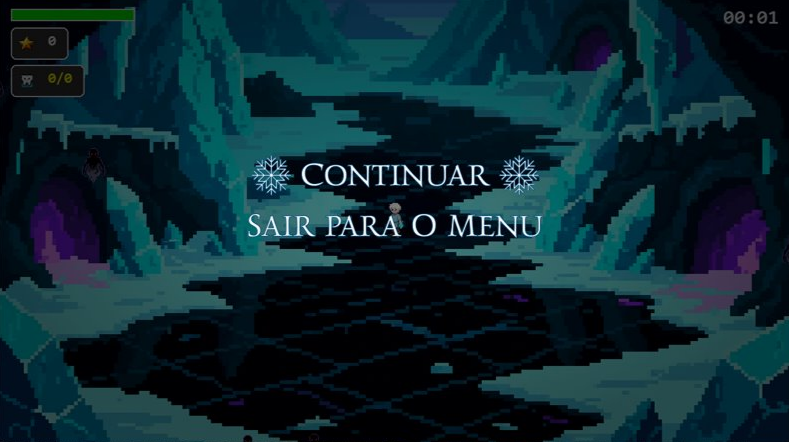
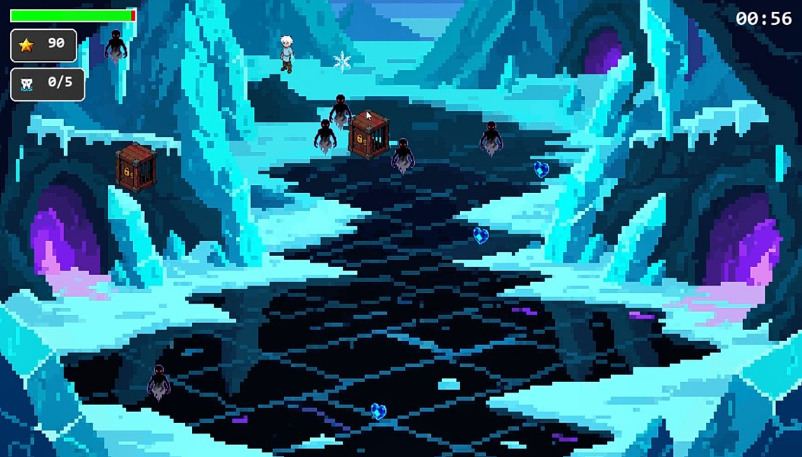
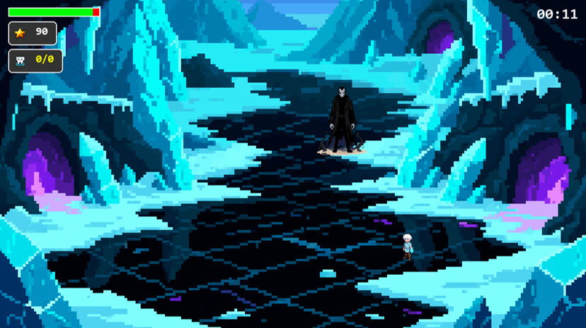
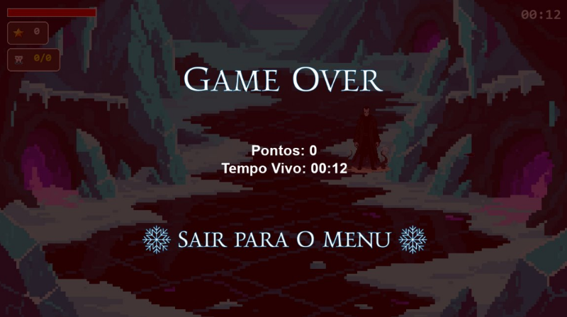
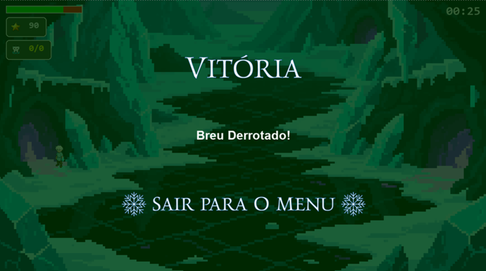

# Guardiões: O CInverno das Sombras

Projeto desenvolvido para a disciplina de Introdução à Programação do período de 2025-2.
Um jogo Roguelike top-down shooter desenvolvido em Python com PyGame.

## 🎮 Como Jogar
- **WASD**: Movimentação do Jack Frost.
- **Mouse**: Disparar raios de gelo.
- **Objetivo**: Sobreviva aos pesadelos, salve as crianças nas gaiolas para coletar os Dentes e derrote o Breu.

## 🛠️ Instalação
1. Clone o repositório:

   ```bash
   git clone https://github.com/usuario/nome-do-jogo.git
   ```

2. Instale as dependências:

   ```py
   pip install -r requirements.txt
   ```
3. Execute o jogo:

   ```py
   python main.py
   ```

## 👥 Equipe

- **Arthur Luz**
- **Eduardo Neves**
- **Elias Cirilo**
- **Gabriel Belo**
- **Jéssica Torres**
- **Luiz Henrique**

## 📂 Estrutura

```
│
├── .gitignore          # Ignora lixo (venv, __pycache__, .DS_Store)
├── README.md           # Documentação (Como rodar, créditos)
├── requirements.txt    # Dependências (pygame)
├── main.py             # Ponto de entrada (Inicializa o Pygame e chama GameManager)
│
├── assets/             # MÍDIA
│   ├── images/
│   │   ├── characters/ # Sprites do Jack, Inimigos e Boss, Projéteis
│   │   ├── itens/      # Sprites de Coração, Cristal, Dente, Gaiola 
│   └── └── itens_menu/ # Botões, Logo, Ícones de HUD, mapa
│   
└── src/                
    ├── __init__.py     # Arquivo vazio (necessário para importar pastas)
    ├── config.py       # As "Leis": Tamanho tela, Cores, FPS
    │
    ├── game_manager.py # Loop principal, Spawner, Timer, Controle de Estados (Pause e Game Over)
    ├── menu.py         # Telas: Menu Inicial
    ├── ui.py           # HUD: Desenha vida, pontuação e tempo DURANTE o jogo
    │
    ├── player.py       # Classe do Jack (Movimento, Inputs)
    ├── projectile.py   # Classe do Tiro de Gelo (pode ser separado ou dentro de player.py)
    │
    ├── enemies/        # PASTA DOS INIMIGOS (IA)
    │   ├── __init__.py
    │   ├── base.py     # Classe Pai (Vida, Movimento de perseguir)
    │   ├── common.py   # Classes Filhas (Espírito, Cavalo)
    │   └── boss.py     # Classe Filha Especial (O Breu)
    │
    └── collectibles.py # Classes: Gaiola, Dente, Coração, Cristal
```

## ✅ Divisão de Tarefas

| Responsável | Tarefa |
| :--- | :--- |
| Arthur Luz | Interações & Coletáveis | 
| Eduardo Neves | Jogador & Combate |
| Elias Cirilo | Animação & Código UI | 
| Gabriel Belo | Câmera & Estados |
| Jéssica Torres | Cenário/Boss & Menu Code |
| Luiz Falcão | Inimigos & Boss |

## 📈 Desafios & Lições

- Um dos principais desafios foi a adaptação às ferramentas e conceitos utilizados no projeto, especialmente o Pygame e a estruturação em Programação Orientada a Objetos, exigindo maior cuidado com modularização e integração entre classes.​

- Também enfrentamos dificuldades na organização do desenvolvimento em equipe com Git/GitHub, utilizando branches e integrando alterações simultâneas, o que demandou coordenação e atenção em merges.​

- Além disso, o projeto foi desenvolvido em um prazo curto, já que esse final de período foi bem corrido com as demais disciplinas.​

## 🕹️ Capturas de Tela

### Menu Principal


### Pause Interno



### Inimigos comuns



### Boss



### Game Over



### Game Win

